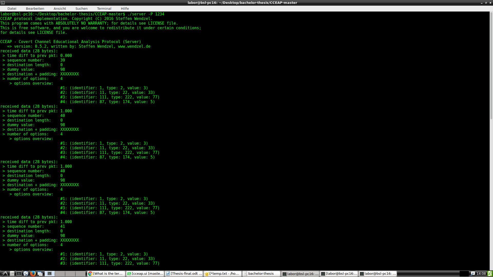

# Design and Implementation of CCEAP user Interface

Bachelor Thesis Submitted as Partial Fulfillment of the requirements for the Degree of B.S.
in Applied Computer Science
at the Hochshule Worms (University of Applied Sciences), 

submitted on: Summer 2017,

by: Fabrice Feugang Kemegni,

matrikel: 671707,

Supervised by: [prof. Dr. Steffen Wendzel](http://steffen-wendzel.blogspot.de/p/blog-page.html)

### This thesis was however rejected because it was submitted after due date. 
### I missread the due date, I sumitted on the 10th July instead of the 7th July
### because I missread 7.07.2017 to 17.07.2017.

## Abstract

The thesis discusses the development of a Graphical User Interface (GUI) to complement a command line progra CCEAP.

[CCEAP](https://github.com/cdpxe/CCEAP) (Covert Channel Educational Analysis Protocal) is a network protocl in the form a command line program designed by my supervisor
[prof. Dr. Steffen Wendzel](http://steffen-wendzel.blogspot.de/p/blog-page.html), to help teach covert channels and hidding patterns.

The CCEAP is an existing command line program that required a user interface, so my task was to create such a User Interface,

This is also what I did in this thesis.

## About the CCEAP-GUI

The Program is written in C++ using QT Creator,

it consists of 2 programs, a server and a client that each complement/emulates the innitial CCEAP cmd programs.

1. Server: 
   The server is started on a given TCP Port Number and it waits for incomming client connections
2. Client
   The client is started with a given IP address and TCP Port Number of the server as well as several CCEAP Paramenters
   CCEAP Parameters. see [CCEAP Parameters](https://github.com/cdpxe/CCEAP/tree/master/documentation)
 

## About the content of this repository

1. /CCEAP-Serveris/: contains the qt creator project for the server-GUI tool

2. /CCEAP-Client/: Contains the qt creator project for the client-GUI tool

3. /CCEAP-master/: Contains the repository downloaded from Prof Steffen Wendzel in June 2017 [to CCEAP-master](https://github.com/cdpxe/CCEAP)

4. /deployed/: contains the folder in which the compiled programs are stored

# Running the programs

## On Windows 

the whole content of deployed/Windows/ must be copied into the target machine because all the .dll files are required to run the program on windows.

Once copied in a target folder, double click on either of server-GUI.exe or client-GUI.exe to start the program.
	
## On Linux

 For Unix architectures, open the terminal in the folder where the executables are found, then start the programs in the terminal

    ./client-gui
    ./server-gui
      

## Screenshots

    Below are 2 sets of screenshots.
    'A.' are the screenshots of the command line program of the cceap.
    'B.' are the screenshots of the GUI Program inplemented in this thesis

### A. Screenshot from the command line program ()

1. Server started and waiting for client's connection

    
___

2. Client connects to the server using the server's port number an ip adress

    
___

3. Client connected to server, server beegins sening the packets correcponding to the client's request (parameters=

    
___

4. Server sending packets to a conneted client

    

#### B. Screenshots from the CCEAP-GUI
___

1. Start page of the CCEAP-GUI. This is the page that appears when you start the CCEAP-GUI.

    
___

2. This is the page that appears when you start the Server-GUI.

    
___

3. Parameters are been set to the client's GUI.

    
___

4. Server's output to client's when a client sends a request.

    
___

5. Server's output to client's when a client sends a request.

    
